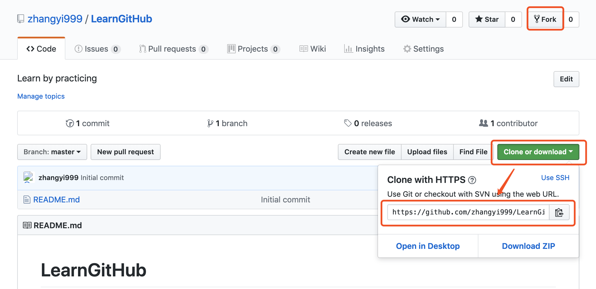

# LearnGitHub
Learn by practicing

## 写在前面

教程的目的是让零基础小白能学会使用GitHub完成工作任务。
我们将通过该教程学会使用Git完成如下内容：

* 安装下载一个Git
* Fork项目到自己的仓库
* 修改文件
* Push自己的修改文档
* 同步最新版本


### 下载及安装

在使用Git前我们需要先安装 Git。Git 目前支持 Linux/Unix、Solaris、Mac和 Windows 平台上运行。
Git 各平台安装包下载地址为：http://git-scm.com/downloads 。

安装完成后打开终端输入：
```
> git --version
  git version 2.16.2
```
这就说明已经安装成功了。

然后在自己的PC端建个文件夹，打开这个文件夹，进入终端，输入：
```
> git init
```
初始化文件夹，以后的项目都可以放到这个文件夹。


### Fork这个项目

首先你得有自己的git账号，如果没有请点击最右上角的 "Sign Up" 按钮。
有账号的登录自己的账号。

先 Fork 该教程到自己的仓库，如图点击右上角：



复制链接，在终端中输入：
```
> git clone https://github.com/******/LearnGitHub.git 
```
经过一系列的操作后，你就可以在自己的仓库中看到这个项目了。


### 修改本地文件

克隆完这个项目后，打开文件夹就可以看到这个项目的本地文件了，用户编辑器打开 README.md
就可以尽请的添加你想添加的内容了。

接下来你可以在文件夹中新建一个 TEST.md 文件，打开文件，输入：这是我的第一个 Git 提交，保存文件。
切换到终端，输入：
```
> git status
  ...
  modified:   TEST.md
  ...
```

这个命令是查看本地代码库修改了写啥。


### 更新自己的GIT

`git status` 命令是查看本地代码库被修改过得文件，`modified:   TEST.md` 红色表示 `TEST.md` 这个文件被修改了。

现在我们在终端执行：
```
> git add TEST.md
```
这个命令是将`TEST.md`这个被修改的文件添加到本地git代码仓库，`git add .` 表示将所有的修改添加到本地git代码仓库。
完成后，在输入：
```
> git status
```
可以看到`TEST.md`已变成绿色，说明更改添加到本地Git仓库。
继续在终端输入：
```
> git commit -m '第一次提交'
```
`git commit -m '第一次提交'` 命令是将自己的修改做提交处理，`-m` 后面的内容可以自己编写，说明本次提交的目的即可。

commit 完成后，再次 `git status` 你会发现已经看不到 `TEST.md` 文件。

> 提示：如果git提示：Please tell me who you are ，这是因为git提交需要设置你提交使用的用户名，和邮箱。你需要输入：

```
> git config --global user.email '你的注册邮箱'
> git config --global user.name '你的用户名'
```
 
最后我们运行【需联网】：
```
> git push 
```
完成后，在GitHub上就可以看到自己的更新的`TEST.md` 文件了。


### 更新自己的代码库

你GitHub上的代码库是从 zhangyi999 这个库fork过去，这会导致一个问题就是：当源项目更新后，你fork的分支并不会一起更新，需要自己手动去更新。

接下来我们练习一下通过源码库到本地。

1、增加源分支地址到你项目远程分支列表中(此处是关键)，先得将原来的仓库指定为upstream，命令为：
```
> git remote add upstream https://github.com/zhangyi999/LearnGitHub.git
```
这里的git地址是你 FORK 的源码仓库地址。

2、fetch源分支的新版本到本地
```
> git fetch upstream
```

3、合并两个版本的代码
```
> git merge upstream/master
```
  
4、将合并后的代码push到github上去
```
> git push origin master
```

这个流程主要是为了同步源码库更新，比如长时间没更新代码，就需要在修改本地代码前先同步源码。


